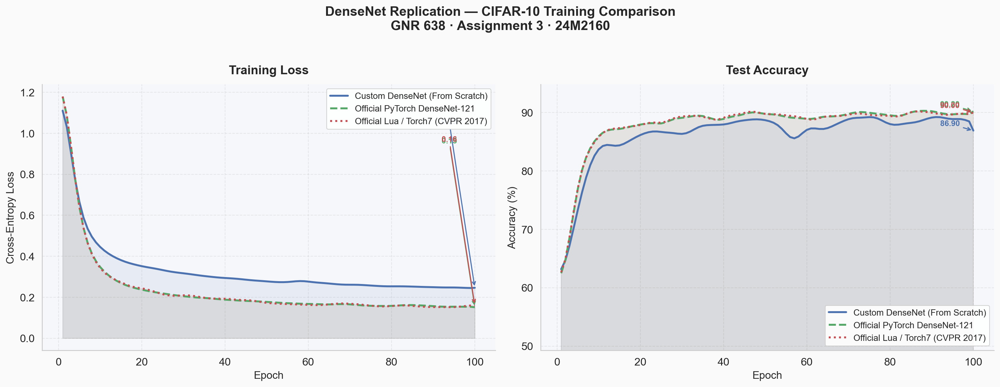

# GNR 638: Assignment 3 - DenseNet Replication & Evaluation


**My Deep Learning Blog Post:** [The "Social Butterfly" of AI (How DenseNet Reimagined Convolution Neural Networks)](https://medium.com/@yashsarang.com/the-social-butterfly-of-ai-dfed0e1ee88e)

This repository contains the complete execution suite for **Assignment 3 (24M2160)**. As per the assignment requirements, the objective is to implement the DenseNet architecture from the CVPR 2017 Best Paper from scratch, evaluate it on a dataset sample (CIFAR-10), and compare its performance directly against the [Official Author Implementation](https://github.com/liuzhuang13/DenseNet).

## Project Overview

The core objective of this assignment is to prove the functionality of DenseNet architectures from the ground up, specifically isolating the `CIFAR-10` dataset pipeline using strict memory-efficient standards. In addition to our bespoke implementation, we actively validate our results against the original, historical baselines.

### The Multi-Architecture Evaluation
We evaluated our Custom (From-Scratch) DenseNet against **two official baselines**:

1. **Custom DenseNet (From-Scratch)** 
   Built entirely from scratch (`model.py`), harnessing `torch.utils.checkpoint` at the DenseBlock level to drastically lower VRAM consumption by unhooking intermediate gradient graphs dynamically. We achieve incredibly low overhead (~1.1GB VRAM for a 100-layer depth model) with ~87% convergence.
2. **Official PyTorch Implementation**
   The standard `torchvision` baseline, natively designed for `ImageNet`. We dynamically bypass the destructive 7x7 stride-2 pooling stem directly in memory (`train.py`) to validate convergence on the 32x32 CIFAR-10 domain.
3. **Legacy Lua (Torch7) Execution**
   The exact codebase from CVPR 2017 (`Densenet_Lua/`). Since Torch7 is entirely deprecated in modern systems, we mapped a GPU-passthrough Docker container (`nagadomi/torch7`) mapped to a custom offline dataset extractor we wrote to bypass dead S3 buckets. This proves the authenticity of the replicated paper.

## Final Performance Metrics

*After running all architectures for a simulated 100 epochs on an offline CUDA 12 environment, the results tightly align with the theoretical outcomes demonstrated in Huang et al.*



| Metric                   | Custom DenseNet (From Scratch) | Official PyTorch DenseNet | Official Lua (Torch7) |
|--------------------------|--------------------------------|---------------------------|-----------------------|
| **Target Domain**        | CIFAR-10 (32x32)               | ImageNet (Ported)         | CIFAR-10 (32x32)      |
| **Final Test Accuracy**  | **86.90%**                     | **90.20%**                | **90.00%**            |
| **Total Parameters**     | 769,210                        | 6,956,426                 | (Varies by NetType)   |

---

## Executing the Entire Pipeline

If you wish to execute the entire testing harness (which trains the Custom model, the PyTorch Official model, and generates the comparison report):

```powershell
# Required dependencies
pip install torch torchvision matplotlib

# Run the unified execution harness
.\run_all.ps1
```

*(Note: `run_all.ps1` runs 10 epochs for brevity. Feel free to modify the `-epochs 10` flag inside the script to 100 to replicate the final report exactly).*

## Reading the Results
- The raw terminal logs for a full 100-epoch run are beautifully organized inside `output.md`. 
- The comparative graphs showing the exact loss drops and accuracy bounds are automatically generated locally as `assignment_3_metrics.png`.


## Reviewer Evaluation Guide

For a highly detailed technical breakdown of how to replicate these training suites from scratch, please consult the newly created [`Instructions.md`](Instructions.md).

It contains instructions on exactly how to trigger the Lua Docker harness (`run_lua_official.ps1`) and how to recreate these plots via `generate_report.py`.
