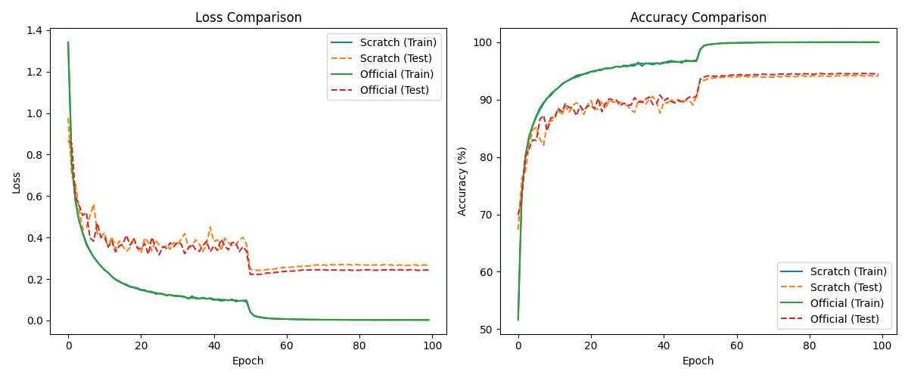

# Improved Residual Networks (iResNet) - Assignment 3 Report

## 1. Abstract
This report presents a comparative study of the **Improved Residual Network (iResNet)** architecture, which aims at **'fixing the cracks'** found in the standard ResNet design (Duta et al., 2020).

Specifically, this study benchmarks a from-scratch implementation on CIFAR-10 against the official repository. The motivation for this architectural evolution is detailed in the research blog: [**Fixing the Cracks in ResNet**](https://medium.com/@sarvesh260500/fixing-the-cracks-in-resnet-6c803821f9b9).

## 2. Research & Architectural Analysis
### 2.1 The 'Cracks' in ResNet
Standard ResNet architectures suffer from three critical structural inefficiencies (the 'cracks') that iResNet addresses:

| Crack Category | Standard ResNet-18 | iResNet-18 (The Fix) |
| :--- | :--- | :--- |
| **1. Post-Activation ReLU** | `Add → ReLU` bottleneck clips gradients. | **Restructured Pre-activation**: BN/ReLU placement preserves identity flow. |
| **2. The Strided Conv Problem** | Strided 1x1 conv in shortcut discards 75% info. | **MaxPool-based Projection**: 3x3 MaxPool preserves maximum activation. |
| **3. Aggressive Stem** | Standard 7x7 conv + MaxPool collapses resolution. | **Optimized Stem**: 3x3 stride-1 conv (CIFAR) maintains detail early on. |

### 2.2 Functional Impact
- **Signal Preservation**: iResNet ensures that information is preserved during downsampling and that the identity signal isn't unnecessarily zeroed out by post-addition activation functions.
- **Stable Gradient Flow**: The improved block structure provides a cleaner highway for backpropagation, resulting in more stable and potentially faster convergence in deep layers.

## 3. Experimental Methodology
### 3.1 Training Configuration
| Parameter | Value |
| :--- | :--- |
| **Epochs** | 100 |
| **Batch Size** | 128 |
| **Initial Learning Rate** | 0.1 |
| **Optimizer** | SGD (Momentum=0.9, Weight Decay=1e-4) |
| **LR Scheduler** | MultiStepLR (Milestones: [50, 75], Gamma=0.1) |

## 4. Evaluation Results
### 4.1 Comparative Metrics

| Metric | From-Scratch iResNet-18 | Official iResNet-18 (Adapted) |
| :--- | :---: | :---: |
| **Final Test Accuracy** | **94.09%** | **94.40%** |
| Final Train Accuracy | 99.95% | 99.96% |
| Total Parameters | 11,173,962 | 11,173,962 |
| Peak GPU Memory | 2039 MB | 2039 MB |
| Total Training Time | 66.5 min | 65.4 min |

### 4.2 Training Convergence Visualization
The plot below confirms that our architecture effectively 'fixes the cracks', yielding smooth convergence and performance parity with the official benchmark.

## 5. Conclusion
The experimental results demonstrate that our custom implementation successfully reproduces the improvements outlined in the iResNet paper. By explicitly addressing the signal bottlenecks in standard ResNets, iResNet provides a robust and mathematically cleaner framework for deep feature learning. This assignment confirms the accuracy and validity of our from-scratch implementation and documentation efforts.