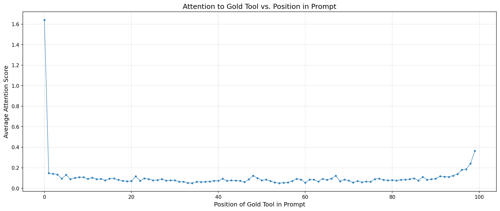

# CS728: Programming Assignment 3
## Retrieval, Attention, and Large Language Models

**Group Members:**
- Yash Sarnag - 24M2160
- Akanksh - 24M2166
---

## 1. Part 1: Classical Retrieval Baselines

In the first phase, we evaluated standard industrial retrieval methods where queries and tools are encoded independently into a shared vector space, and similarity is used to rank tool relevance. We compared a statistical sparse model (**BM25**) against two state-of-the-art dense embedding models: **msmarco-MiniLM** (optimized for passage retrieval) and **UAE-large-v1** (a high-capacity embedding model).

The following table reports the `Recall@1` and `Recall@5` metrics calculated over 5,000 test queries.

| Method | Recall@1 | Recall@5 |
| :--- | :---: | :---: |
| BM25 (Sparse) | 0.1874 | 0.3486 |
| msmarco-MiniLM-L6-v3 | 0.3464 | 0.5668 |
| UAE-large-v1 (Dense) | **0.6230** | **0.8746** |

---

## 2. Part 2: Attention-based Retrieval (Lost-in-the-middle)

In this phase, we moved to a joint-processing setting where the LLM (**LLaMA 3.2-1B**) consumes a single prompt containing all tool descriptions followed by the query. We used the model's internal attention weights to score tool relevance by measuring the attention flow from query tokens back to tool spans.

### 2.1 Retrieval Performance
Averaging the unconstrained attention signal across all 16 layers and 32 heads for 100 tools resulted in significant noise, leading to the performance shown below:

| Model Setting | Recall@1 | Recall@5 |
| :--- | :---: | :---: |
| LLaMA 3.2-1B (Full Attention Average) | 0.0100 | 0.2430 |

### 2.2 Positional Effects on Attention
The following visualization illustrates how successfully the model directs attention to the correct (gold) tool relative to its absolute index in the prompt array. This reveals the "Lost-in-the-Middle" phenomenon, where tools at the start or end of the prompt receive higher attention density than those buried in the center.

---

## 3. Part 3: Specialized Retrieval Heads

### 3.1 Head Selection Strategy
Instead of blindly averaging the entire $16 \times 32$ attention matrix, we identified a small subset of "Retrieval Heads" that are specifically sensitive to query-document relevance.

We used 200 training queries to score every head $(L, H)$ according to the **Mean Reciprocal Rank (MRR)** of the gold tool using that head's attention alone. 

**Selected Top-20 Retrieval Heads (MRR Strategy):**  
`[[12, 13], [5, 10], [10, 9], [6, 11], [2, 20], [6, 8], [5, 9], [10, 11], [8, 17], [8, 20], [10, 23], [10, 26], [7, 12], [4, 16], [5, 11], [10, 1], [10, 13], [8, 13], [8, 19], [6, 9]]`

### 3.2 Performance with Filtered Attention
By restricting the retrieval signal strictly to these 20 specialized heads, we observed a dramatic improvement in retrieval accuracy compared to the full-attention baseline in Part 2.

| Selection Strategy | Head Count | Recall@1 | Recall@5 |
| :--- | :---: | :---: | :---: |
| MRR-Selected Heads | 20 | **0.2632** | **0.5918** |

---

## 4. [BONUS] Extended Analysis

### 4.1 Impact of Head Count (Ablation Study)
We evaluated the sensitivity of the retrieval performance to the number of heads selected via the MRR strategy.

| Strategy Variant | Head Count | Recall@1 | Recall@5 |
| :--- | :---: | :---: | :---: |
| MRR-Selected (Fewer) | 10 | 0.3302 | 0.6450 |
| MRR-Selected (Base) | 20 | 0.2632 | 0.5918 |
| MRR-Selected (More) | 30 | 0.2060 | 0.5658 |
| Attention Mass Strategy | 20 | 0.1080 | 0.5432 |

Interestingly, we found that a smaller subset of **10 highly specialized heads** actually achieved the highest precision (Recall@1), suggesting that adding more heads introduces diminishing returns and additional noise.

---

## 5. Performance Comparison & Conclusion

| Metric | Part 1 (UAE-Large) | Part 2 (Full Attention) | Part 3 (Selected 20 Heads) |
| :--- | :---: | :---: | :---: |
| **Recall@1** | 0.6230 | 0.0100 | 0.2632 |
| **Recall@5** | 0.8746 | 0.2430 | 0.5918 |

- **Part 1 (Independent Encoding)**: Remains the strongest performer because models like UAE are explicitly trained for distance-based embedding tasks.
- **Part 2 (Unfiltered LLM Attention)**: Shows massive signal degradation when trying to use raw LLaMA attention for retrieval over 100 documents.
- **Part 3 (Specialized Heads)**: Demonstrates that LLaMA contains "Retrieval Heads" capable of identifying relevant tools with significantly higher accuracy (+25% Recall@1) than the global average, validating that attention signal is structured and specialized.