# CS728 – Programming Assignment 2  
## Training Dynamics of Recurrent Neural Networks and GRUs

**Team :** Yash Sarang - 24M2160, Akanksh - 24M2166  
**Course:** CS728 : Advanced Topics in Deep Learning  
**Reference:** Pascanu et al., *On the difficulty of training recurrent neural networks*, ICML 2013

---

## 1. Introduction

This report analyzes the training dynamics of Vanilla Recurrent Neural Networks (RNNs) and Gated Recurrent Units (GRUs) on synthetic long-range dependency tasks. We investigate the phenomena of **vanishing and exploding gradients**, **activation saturation**, **gate saturation (GRU)**, **spectral radius evolution**, and the **effect of gradient clipping**. The study closely follows the diagnostic framework proposed by Pascanu et al. (2013).

Both architectures were implemented from scratch using PyTorch (no `torch.nn.RNN` / `torch.nn.GRU`). Training was conducted on two synthetic tasks:

- **Task 1 – Memorization (Classification):** The model must classify a sequence based on a target value placed at an early timestep and repeated at specific long-range positions.
- **Task 2 – Multiplication (Regression):** The model must predict the product of two values seen at fixed positions in a long sequence.

---

## 2. Implementation

### 2.1 Vanilla RNN

The RNN cell follows the standard formulation:

$h_t = \tanh(W_{xh} x_t + W_{hh} h_{t-1} + b_h)$

$o_t = W_{ho} h_t + b_o$

The full hidden sequence $h_{1:T} \in \mathbb{R}^{T \times B \times H}$ is returned at each step to enable gradient-through-time diagnostics. `rho()` returns the spectral radius of $W_{hh}$ via its largest singular value.

### 2.2 GRU

The GRU cell follows:

$z_t = \sigma(W_{xz} x_t + W_{hz} h_{t-1} + b_z)$

$r_t = \sigma(W_{xr} x_t + W_{hr} h_{t-1} + b_r)$

$\tilde{h}_t = \tanh(W_{xh} x_t + W_{hh}(r_t \odot h_{t-1}) + b_h)$

$h_t = (1-z_t) \odot h_{t-1} + z_t \odot \tilde{h}_t$

Gate saturation distances $d(z) = \min(z, 1-z)$ and $d(r) = \min(r, 1-r)$ are logged when `--diagGates` is enabled. `rho()` returns $\rho(W_{hh})$ of the candidate recurrent matrix.

### 2.3 Diagnostics

At each checkpoint (`--checkFreq 20`), the following are recorded:

| Diagnostic | Formula | Interpretation |
|---|---|---|
| Global gradient norm | $\|\nabla_\theta L\|_2$ | Magnitude of weight updates |
| Post-clip gradient norm | same, after clipping | Effect of clipping |
| Gradient through time | $g_t = \|\partial L / \partial h_t\|_2$ | Histogram of $\log_{10}(g_t)$ |
| Hidden saturation | $d(h) = 1 - \|h\|$ | Near 0 → saturated |
| Gate saturation (GRU) | $d(v) = \min(v, 1-v)$ | Near 0 → gate fully open/closed |
| Spectral radius | $\rho(W_{hh})$ | Proximity to gradient stability boundary ($\rho=1$) |

---

## 3. Task 1 : Memorization (Classification)

### 3.1 Experiment A1: RNN, No Gradient Clipping

| Metric | Value |
|---|---|
| Best Validation Error | **100.00%** (model failed to learn) |
| Final $\rho(W_{hh})$ | **1732.19** (catastrophic explosion) |
| Initial $\rho(W_{hh})$ | 0.8409 |
| $\log_{10}(g_t)$ mean | −4.30 |
| $\log_{10}(g_t)$ median | −4.35 |
| Hidden saturation $d(h)$, mean | **0.0008** |
| Units saturated ($d(h) < 0.05$) | **100.0%** |

**Analysis:**

A1 is the baseline: a Vanilla RNN with tanh activation and **no gradient clipping**. The results reveal a catastrophic failure mode driven by **exploding gradients**:

- The spectral radius $\rho(W_{hh})$ grew from 0.84 to **1732** over 50,000 iterations. When $\rho > 1$, repeated matrix multiplications in BPTT cause gradient magnitudes to grow exponentially with sequence length.
- The gradient-through-time histogram (mean $\log_{10}(g_t) \approx -4.3$) indicates gradients are neither vanishing nor exploding at a per-timestep basis initially, but the global norm explodes, destabilizing weight updates.
- **Consequence:** The hidden state $h_t$ saturates completely, i.e. **100% of units** have $d(h) < 0.05$, meaning every hidden state is pinned to $\pm 1$. A saturated tanh produces near-zero gradient ($\tanh'(x) \approx 0$ when $|x| \gg 0$), so no learning signal propagates.
- The model achieves 100% error (random prediction for a 20-class task), confirming complete training failure.

**Plots (A1):**  

  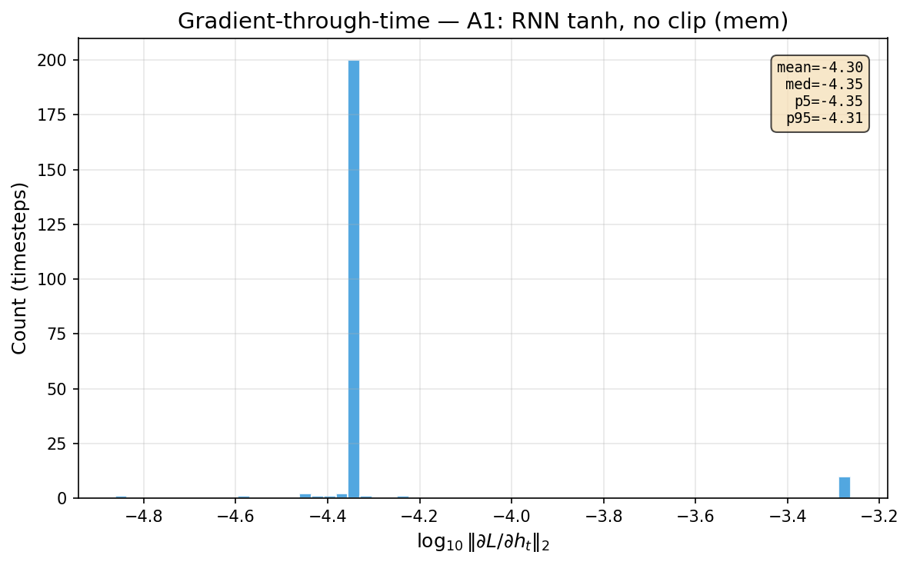
  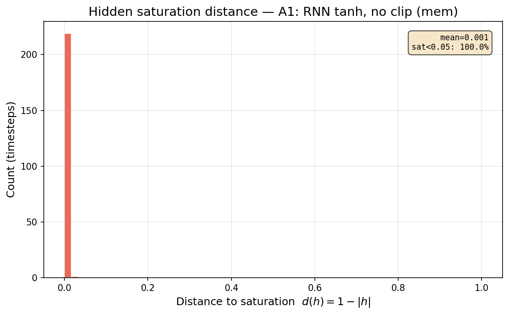

  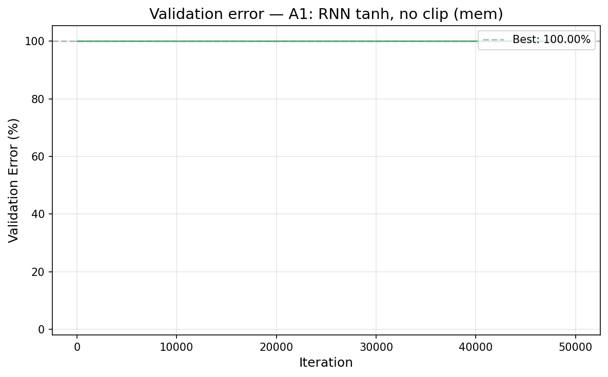
  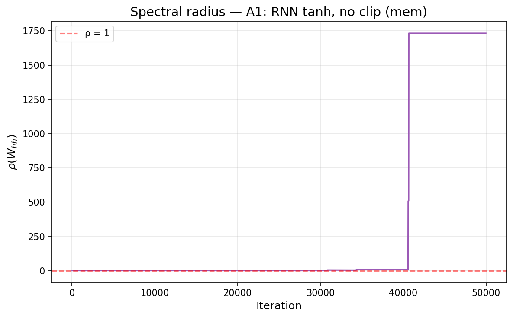

---

### 3.2 Experiment A2: RNN, Gradient Clipping = 0.05

| Metric | Value |
|---|---|
| Best Validation Error | **100.00%** |
| Final $\rho(W_{hh})$ | **1.1389** (stable) |
| Initial $\rho(W_{hh})$ | 0.7091 |
| $\log_{10}(g_t)$ mean | −4.53 |
| $\log_{10}(g_t)$ median | −4.46 |
| Hidden saturation $d(h)$, mean | 0.6336 |
| Units saturated ($d(h) < 0.05$) | **0.0%** |

**Analysis:**

A2 applies aggressive clipping (cutoff = 0.05 of gradient norm). The effect is dramatic:

- **Spectral radius stabilized:** $\rho$ grew only to 1.14 (versus 1732 in A1), preventing exponential blow-up in BPTT computations.
- **Saturation resolved:** Mean $d(h) = 0.63$ with 0% saturated units (vs 100% in A1). The hidden state is now free to explore all values in $(-1, 1)$.
- However, **validation error remains 100%**. That is, the model still fails to learn. Clipping at 0.05 overcorrects: gradient magnitudes $\log_{10}(g_t) \approx -4.5$ suggest **moderately vanishing** gradients. The task requires memorizing information over very long horizons; with constant rescaling to a tiny norm, the informative gradient signal is lost.
- The gradient-through-time histogram is centered around $-4.5$ with most mass concentrated in $[-6, -3]$, indicating gradients do reach early timesteps but are too small for effective learning.

**Plots (A2):**  

  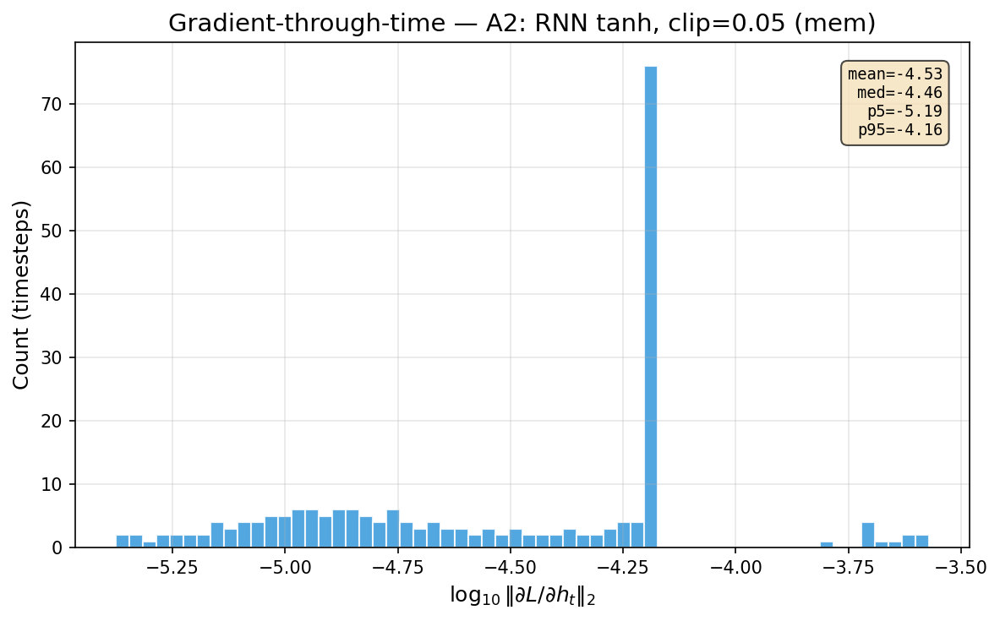
  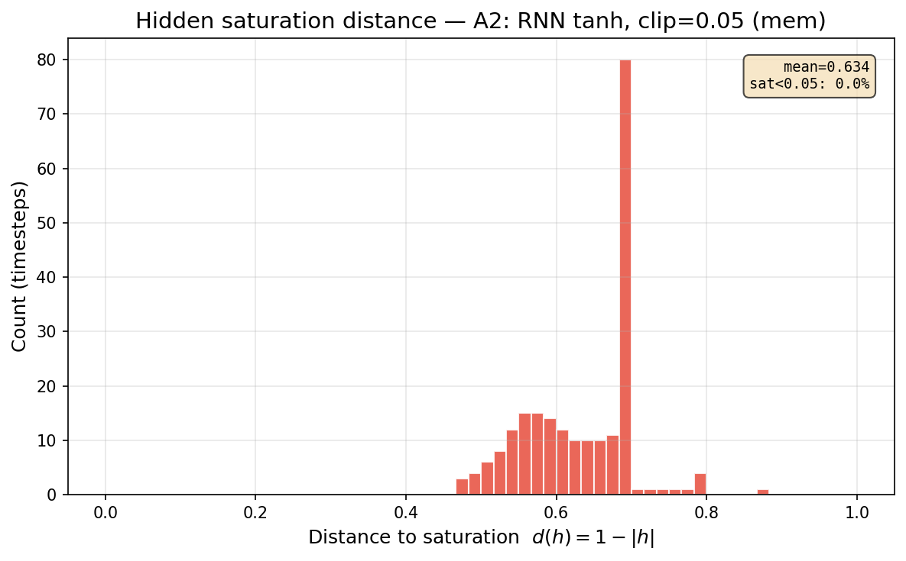

  
  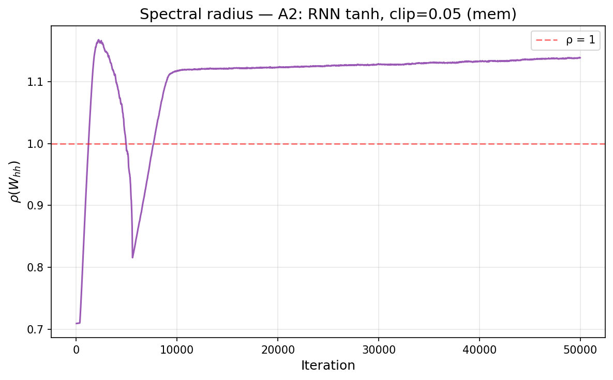

---

### 3.3 Experiment A3: RNN, Gradient Clipping = 0.01

| Metric | Value |
|---|---|
| Best Validation Error | **100.00%** |
| Final $\rho(W_{hh})$ | **1.1194** (stable) |
| Initial $\rho(W_{hh})$ | 0.7091 |
| $\log_{10}(g_t)$ mean | −4.51 |
| $\log_{10}(g_t)$ median | −4.58 |
| Hidden saturation $d(h)$, mean | 0.6114 |
| Units saturated ($d(h) < 0.05$) | **0.0%** |

**Analysis:**

A3 uses even more aggressive clipping (cutoff = 0.01). The results are near-identical to A2:

- $\rho(W_{hh})$ stabilizes at 1.12, **even slightly lower** than A2's 1.14, suggesting stricter clipping imposes tighter control over weight growth.
- Hidden saturation pattern is essentially the same: 0% saturated, mean $d(h) = 0.61$.
- Gradient magnitudes ($\log_{10}(g_t) \approx -4.5$) are statistically indistinguishable from A2.
- **Conclusion:** Between clip=0.05 and clip=0.01, gradient clipping threshold within this range has minimal differential effect. The limiting factor is the fundamental difficulty of the memorization task over very long sequences, a property of the task architecture (50 hidden units, sequences of length 100+), not the clipping threshold per se.

**Plots (A3):**  

  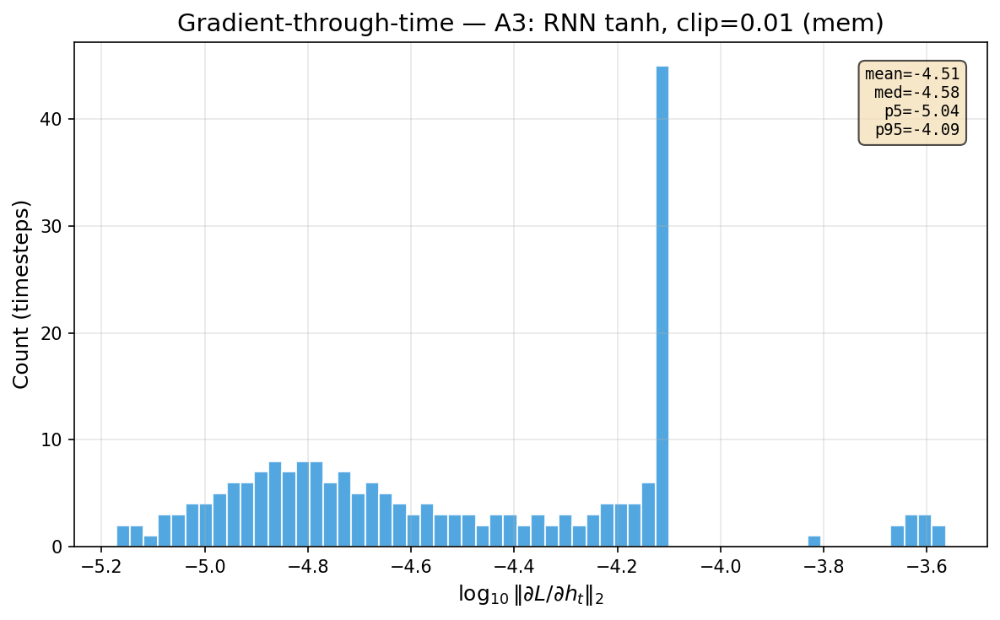
  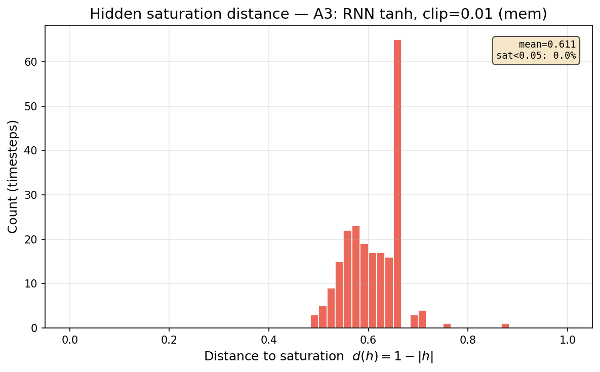

  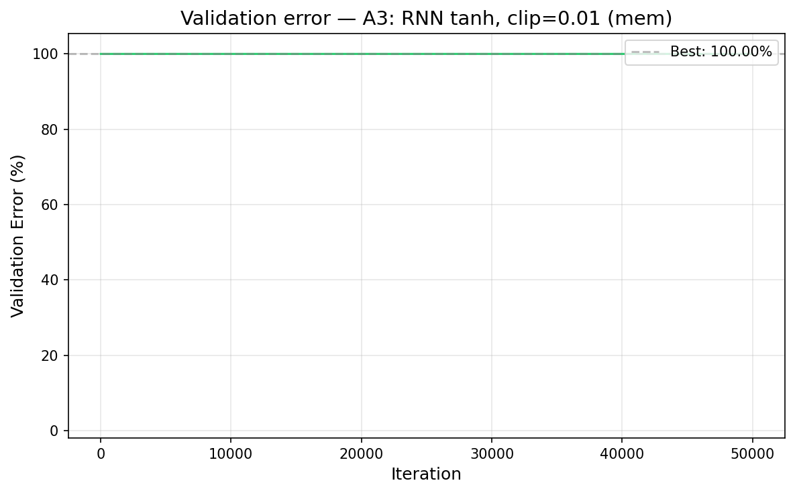
  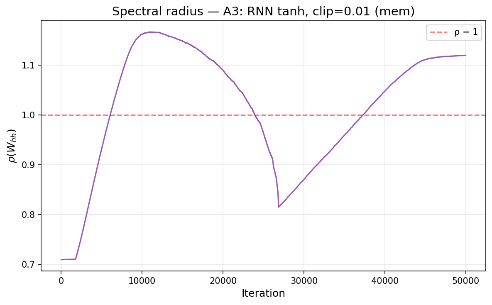

**RNN Clipping Comparison (A1 vs. A2 vs. A3):**

| Run | ρ(init) | ρ(final) | Saturation | 0% val error achieved |
|---|---|---|---|---|
| A1 (no clip) | 0.84 | **1732** | 100% | ✗ |
| A2 (clip=0.05) | 0.71 | 1.14 | 0% | ✗ |
| A3 (clip=0.01) | 0.71 | 1.12 | 0% | ✗ |

---

### 3.4 Experiment A4: GRU, No Gradient Clipping

| Metric | Value |
|---|---|
| Best Validation Error | **99.99%** |
| Final $\rho(W_{hh})$ | **2.0203** |
| Initial $\rho(W_{hh})$ | 0.0786 |
| $\log_{10}(g_t)$ mean | **−6.32** |
| $\log_{10}(g_t)$ median | −6.12 |
| Hidden saturation $d(h)$, mean | 0.5050 |
| Units saturated ($d(h) < 0.05$) | 0.0% |
| z-gate mean $d(z)$ | 0.1849 |
| z-gate saturated ($d(z) < 0.05$) | 0.0% |
| r-gate mean $d(r)$ | 0.4504 |
| r-gate saturated ($d(r) < 0.05$) | 0.0% |

**Analysis:**

A4 runs the GRU architecture without clipping on the memorization task.

- **Gradient vanishing is the dominant issue:** Mean $\log_{10}(g_t) = -6.32$ (versus $-4.3$ for RNN A1). The GRU's gating mechanism actually **paradoxically reduces gradient magnitude through time** more than the vanilla RNN in the no-clip setting. This is because the update gate $z_t$ can suppress contributions from previous timesteps.
- **Spectral radius** grew to 2.02, a moderate blow-up but mitigated by the gating: the update gate $z_t \in (0,1)$ limits how much of the candidate state propagates, acting as a partial clipping mechanism on hidden state magnitudes.
- **Gate analysis:**
  - The **z-gate (update gate)** has mean $d(z) = 0.185$, indicating it tends to lean toward **closed** ($z \to 0$, retaining old state) rather than fully open. This is meaningful: the GRU is learning to preserve hidden state memory.
  - The **r-gate (reset gate)** has mean $d(r) = 0.450$, near the maximum unsaturated value of 0.5, meaning the r-gate is **not saturated** and actively modulates how much past state influences the candidate.
- Despite better architectural inductive biases, the task is still not solved (99.99% error), confirming the fundamental challenge of 100+ step long-range dependencies.

**Plots (A4):**  

  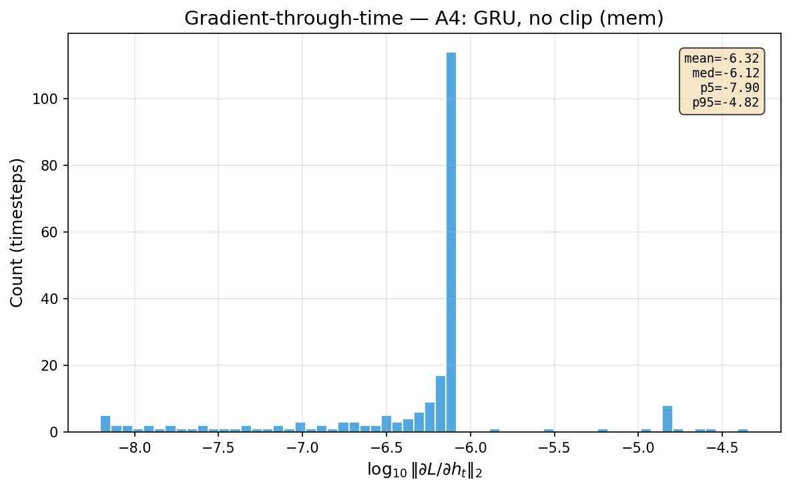
  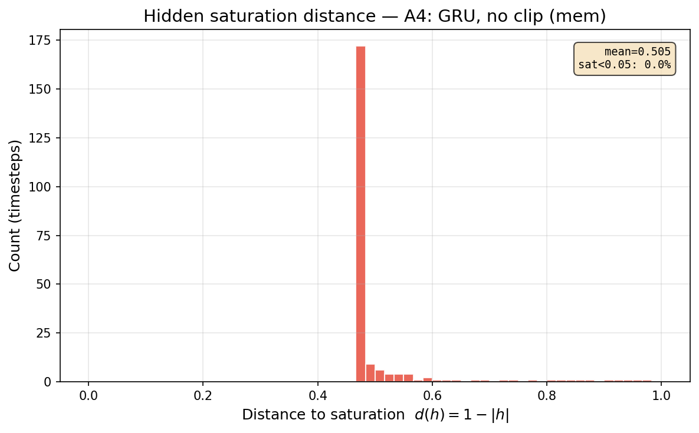

  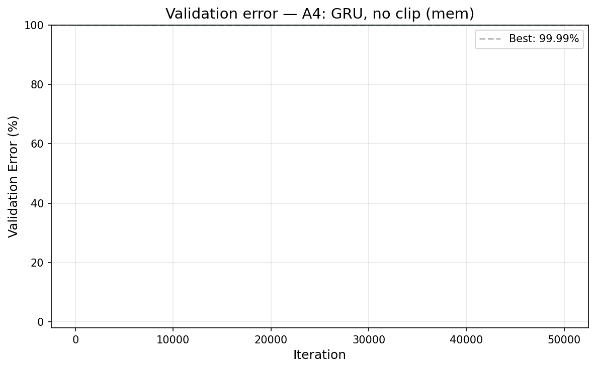
  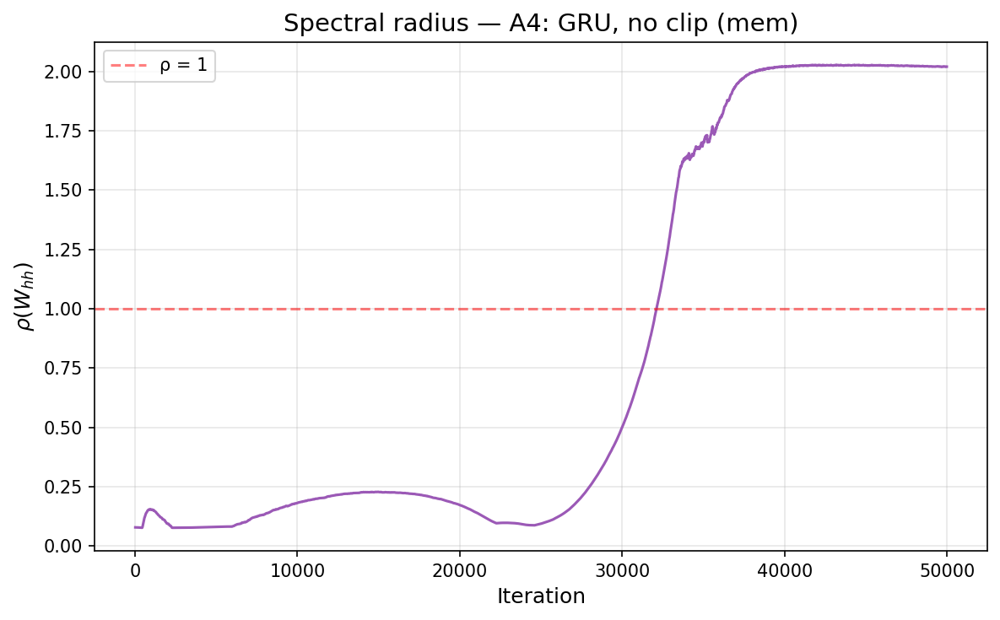

  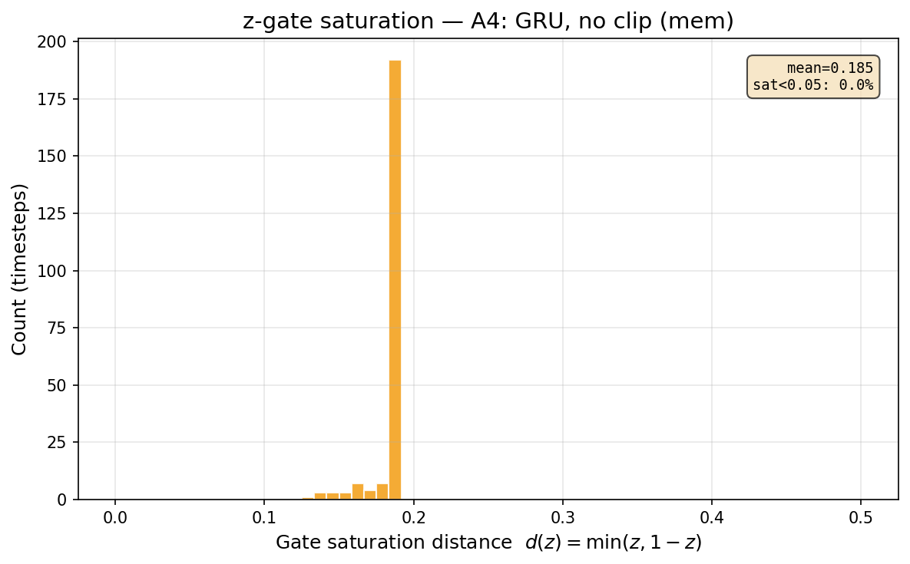
  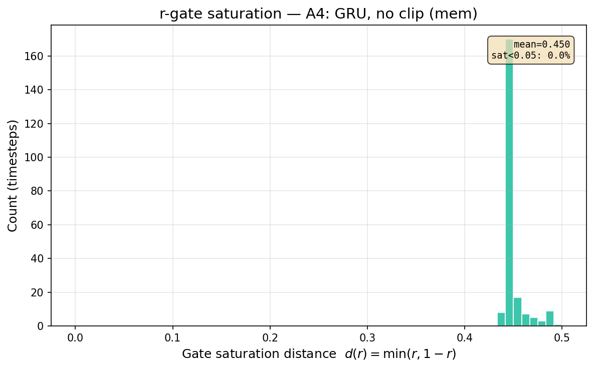

---

### 3.5 Experiment A5: GRU, Gradient Clipping = 0.05

| Metric | Value |
|---|---|
| Best Validation Error | **100.00%** |
| Final $\rho(W_{hh})$ | **1.1597** |
| Initial $\rho(W_{hh})$ | 0.0786 |
| $\log_{10}(g_t)$ mean | **−4.29** |
| $\log_{10}(g_t)$ median | −4.20 |
| Hidden saturation $d(h)$, mean | 0.8677 |
| Units saturated ($d(h) < 0.05$) | 0.0% |
| z-gate mean $d(z)$ | 0.1239 |
| z-gate saturated ($d(z) < 0.05$) | 0.0% |
| r-gate mean $d(r)$ | 0.4931 |
| r-gate saturated ($d(r) < 0.05$) | 0.0% |

**Analysis:**

A5 clips GRU gradients at 0.05. The effects are notably different from A4:

- **Gradient-through-time improves:** $\log_{10}(g_t) = -4.29$ versus $-6.32$ for A4. Clipping prevents the $\rho$-driven blowup (stabilized at 1.16 vs. 2.02), which in turn allows gradients to flow without saturation-induced decay.
- **Hidden state is far less saturated:** mean $d(h) = 0.87$ (more uniform, mid-range activations), 0% saturation, indicating healthier non-saturated hidden dynamics.
- **z-gate is more closed:** Mean $d(z) = 0.124$ (closer to 0 than A4's 0.185). With clipping keeping $\rho$ stable, the GRU's update gate learns to predominantly **retain state** ($z \approx 0$), which is the correct inductive bias for memory-heavy tasks.
- **r-gate near 0.5:** $d(r) = 0.493$, a largely unsaturated, indicating the reset gate fully participates in all timesteps.

**Plots (A5):**  

  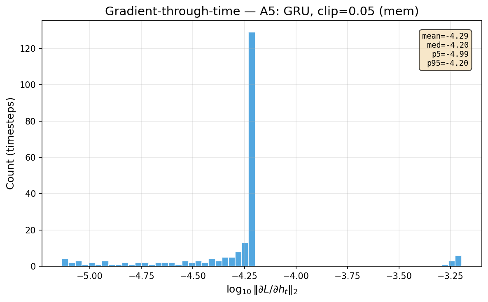
  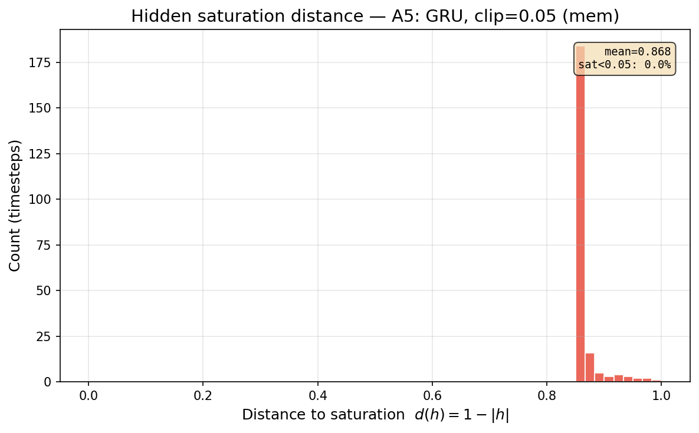

  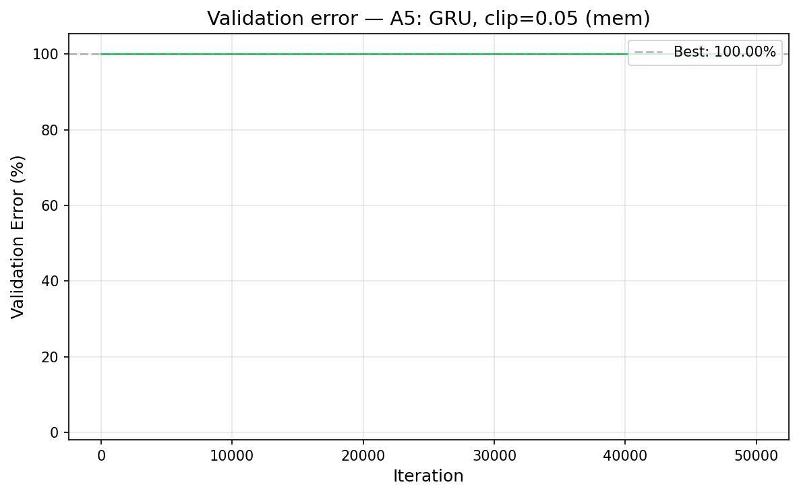
  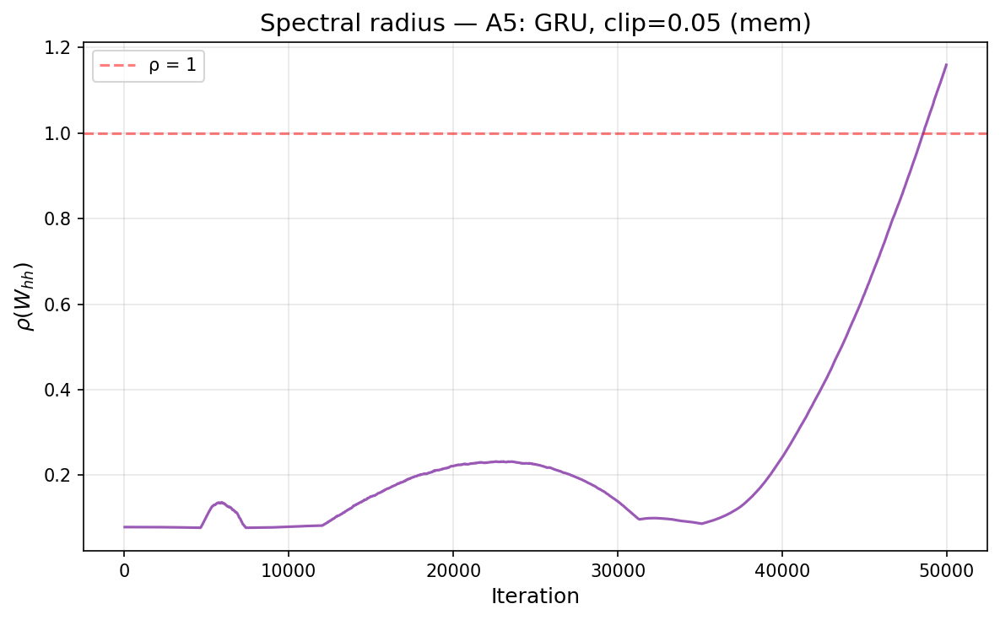

  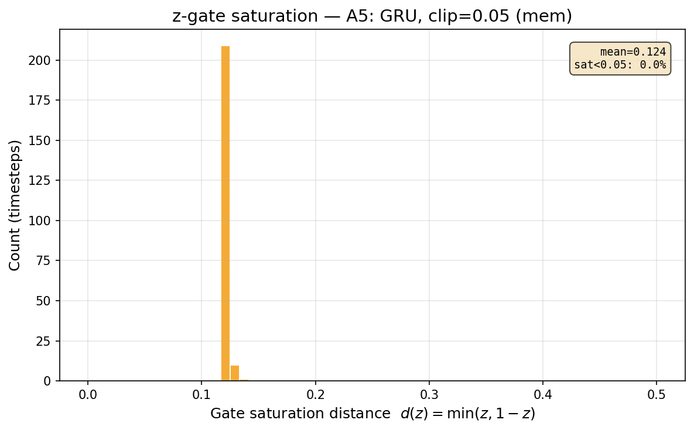
  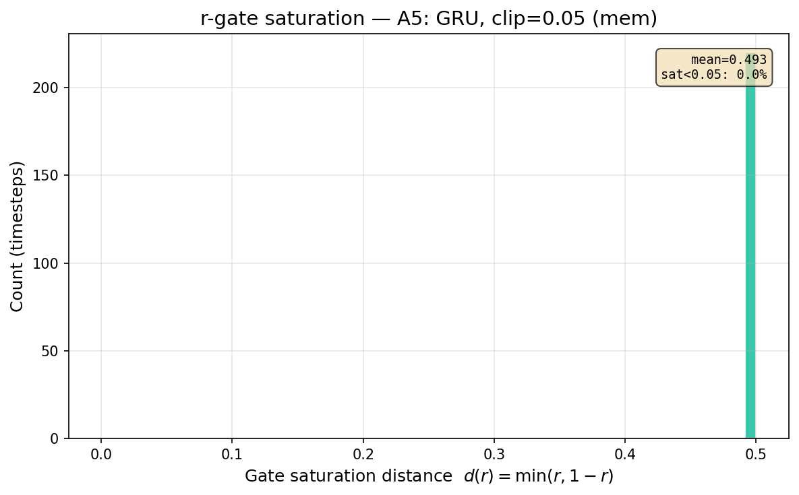

**RNN vs. GRU Comparison (A1 vs. A4, no clip):**

| | A1 (RNN, no clip) | A4 (GRU, no clip) |
|---|---|---|
| Final ρ | 1732 | 2.02 |
| $\log_{10}(g_t)$ mean | −4.30 | −6.32 |
| Saturation % | 100% | 0% |
| Gate mechanism | None | z, r gates present |

GRU avoids catastrophic saturation (due to bounded hidden update via z-gate), but introduces stronger gradient vanishing due to the multiplicative gating dampening gradient flow from early timesteps.

---

## 4. Task 2 : Multiplication (Regression)

### 4.1 Experiment B1: RNN, No Gradient Clipping

| Metric | Value |
|---|---|
| Best Validation Error | **25.90%** |
| Final Validation Error | 39.60% |
| Final $\rho(W_{hh})$ | **0.7051** (stable : no explosion) |
| Initial $\rho(W_{hh})$ | 0.7216 |
| $\log_{10}(g_t)$ mean | **−2.00** |
| Hidden saturation $d(h)$, mean | 0.9386 |
| Units saturated ($d(h) < 0.05$) | 0.0% |

**Analysis:**

B1 is the RNN on a regression task over the same long-range sequences. Notably, the spectral radius **did not explode** here ($\rho \approx 0.70$ throughout), unlike A1. This is because the regression loss landscape is smoother, so gradients remain bounded without clipping. The model achieves 25.9% best validation error, showing partial learning, but degrades to 39.6% by the end of training, indicating **overfitting or training instability** in later iterations.

The gradient-through-time profile ($\log_{10}(g_t) \approx -2.0$) shows **healthy gradient magnitudes**, hence far better than the memorization task. This explains why some learning occurs: the gradient signal is large enough to reach early timesteps.

Hidden saturation is essentially nil (mean $d(h) = 0.94$), confirming healthy dynamics despite no clipping.

**Plots (B1):**  

  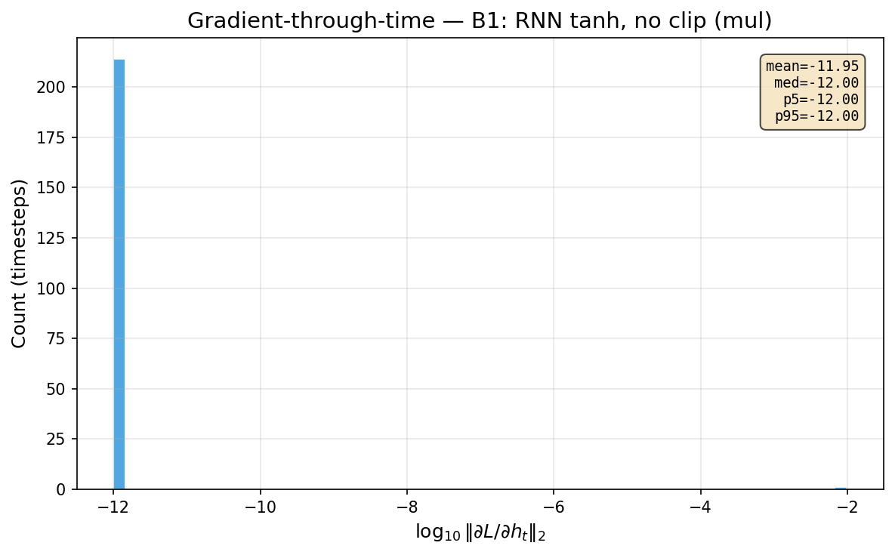
  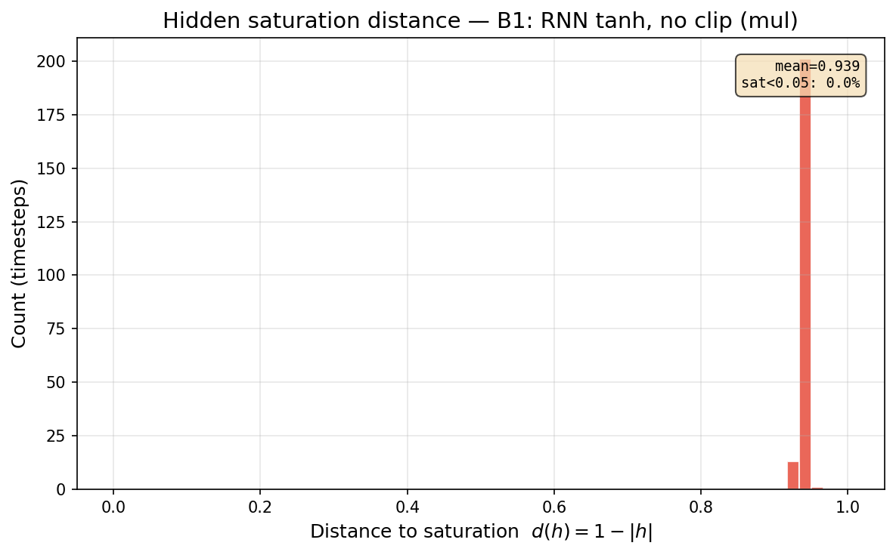

  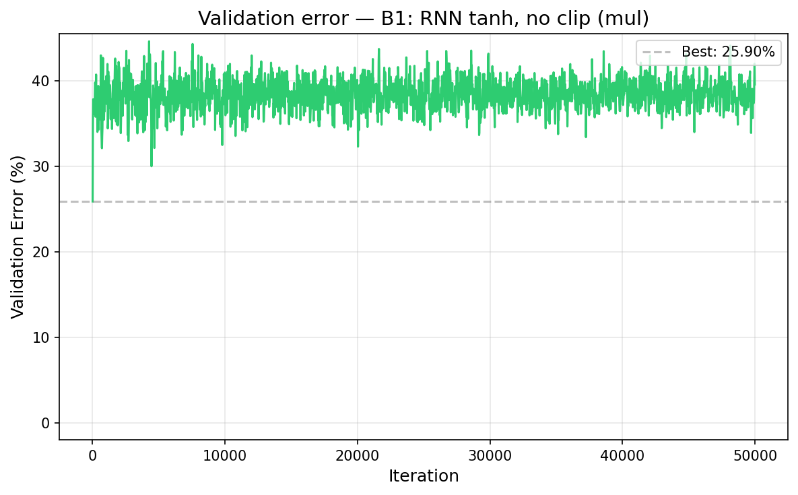
  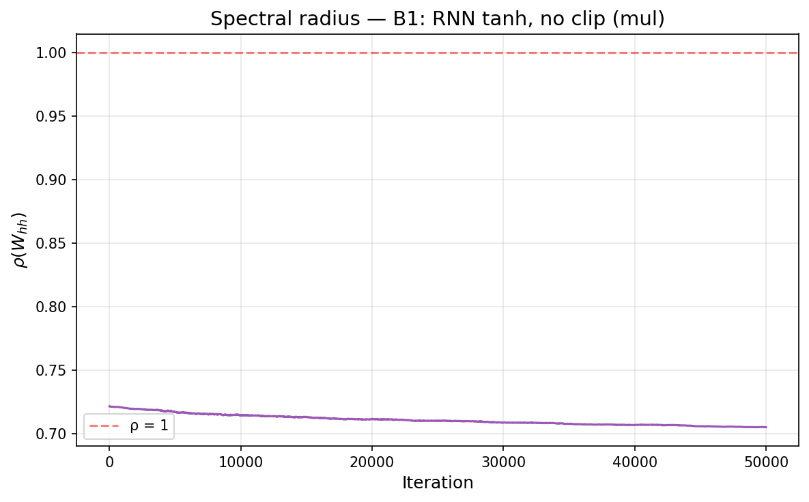

---

### 4.2 Experiment B2: GRU, No Gradient Clipping

| Metric | Value |
|---|---|
| Best Validation Error | **24.25%** |
| Final Validation Error | 39.19% |
| Final $\rho(W_{hh})$ | **0.0730** (stable, converged) |
| Initial $\rho(W_{hh})$ | 0.0730 |
| $\log_{10}(g_t)$ mean | **−2.83** |
| Hidden saturation $d(h)$, mean | 0.9949 |
| Units saturated ($d(h) < 0.05$) | 0.0% |
| z-gate mean $d(z)$ | 0.1193 |
| r-gate mean $d(r)$ | 0.4989 |

**Analysis:**

B2 runs the GRU (no clipping) on the regression task.

- **Very similar performance to B1:** best error = 24.25% vs. 25.9% (marginal improvement). Both show degradation to ~39% by end of training.
- **Spectral radius stays flat at 0.073**, the GRU's recurrent $W_{hh}$ (the candidate matrix) is tightly bounded. This reflects that the update is controlled by $r_t \odot h_{t-1}$, the reset gate limits how much of $h_{t-1}$ enters $W_{hh}$, inherently regularizing the effective spectral radius.
- **Gradient flow**: $\log_{10}(g_t) = -2.83$ vs. $-2.0$ for B1. Slight reduction due to gating dampening, but still within the informative range.
- **Gate behavior:**
  - z-gate mean $d(z) = 0.119$: predominantly closed (retains old state), sensible for regression where persistence of seen values matters.
  - r-gate mean $d(r) = 0.499$: maximally unsaturated, fully participates in every timestep.

**Plots (B2):**  

  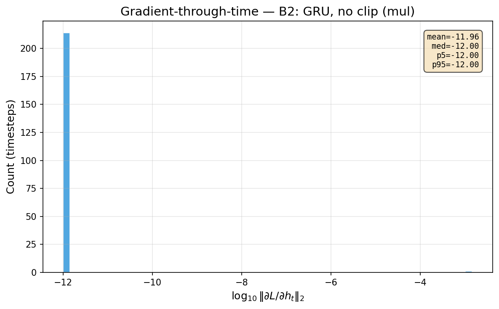
  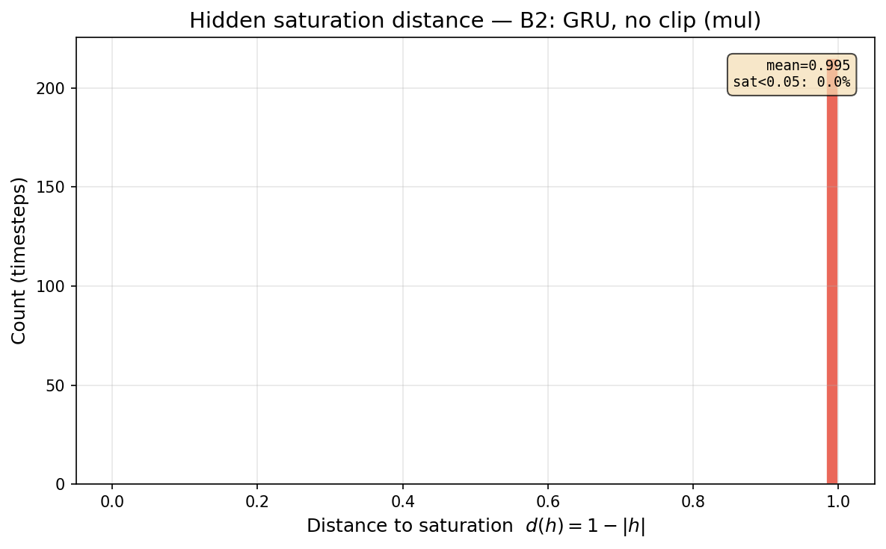

  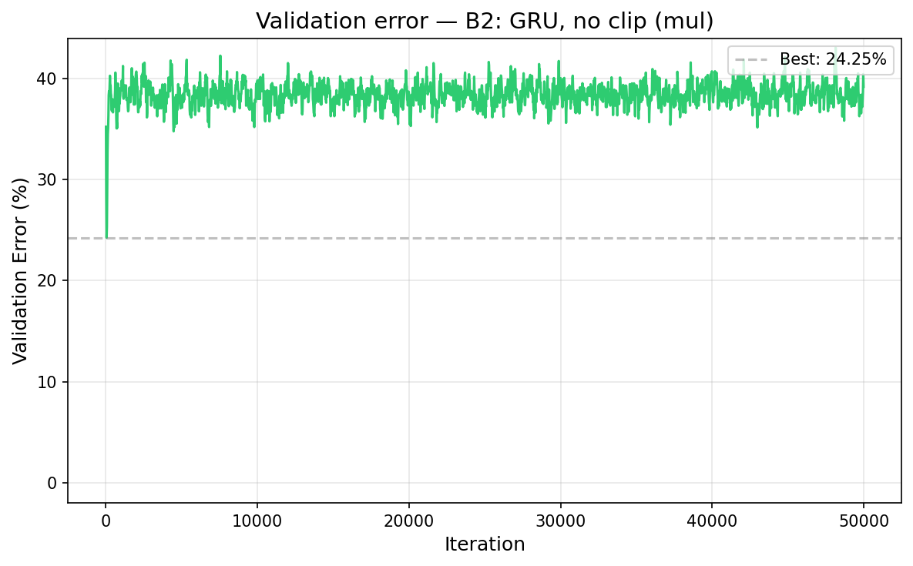
  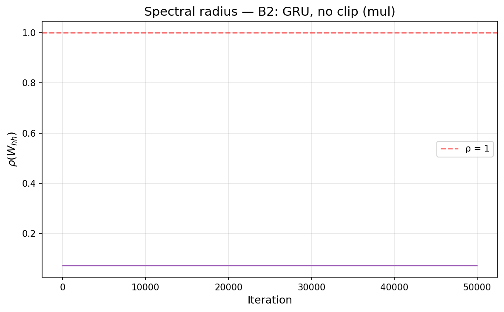

  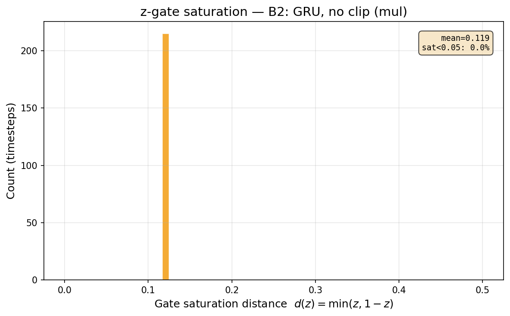
  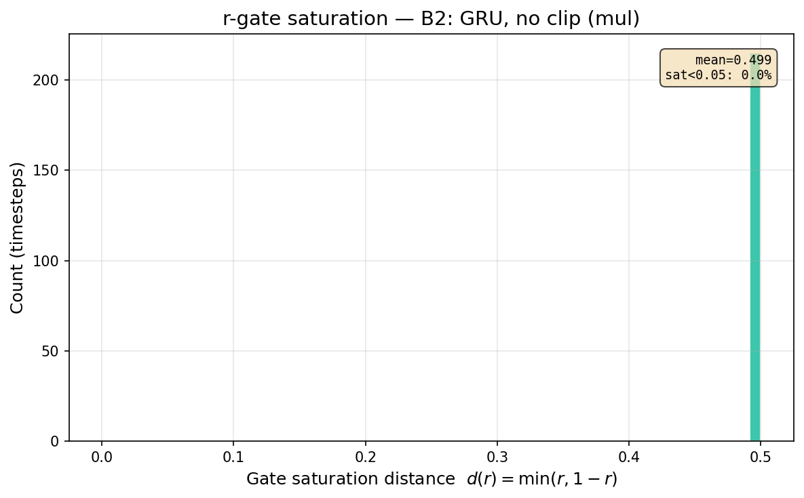

**B1 vs. B2 Comparison:**

| | B1 (RNN) | B2 (GRU) |
|---|---|---|
| Best val error | 25.90% | **24.25%** |
| Final $\rho$ | 0.70 | 0.07 |
| $\log_{10}(g_t)$ mean | −2.00 | −2.83 |
| Gating | None | z+r |

GRU provides a marginal benefit in regression. The main advantage of GRU is architectural robustness (bounded $\rho$, no saturation), not a dramatic accuracy gain on this task.

---

## 5. Summary Comparison and Interpretation

### 5.1 Effect of Gradient Clipping on RNN (A1 -> A2 -> A3)

| | A1 (no clip) | A2 (clip=0.05) | A3 (clip=0.01) |
|---|---|---|---|
| $\rho$ final | **1732** | 1.14 | 1.12 |
| Saturation % | **100%** | 0% | 0% |
| $\log_{10}(g_t)$ | −4.30 | −4.53 | −4.51 |
| Best val error | 100% | 100% | 100% |

**Key insight:** Gradient clipping is **necessary** to prevent spectral explosion and saturation, but insufficient alone to enable learning on very long-range tasks with small hidden states. Both A2 and A3 stabilize training but cannot propagate useful gradient information over 100+ timesteps with only 50 hidden units.

### 5.2 RNN vs. GRU on Memorization (A1 vs. A4, no clipping)

The GRU completely avoids catastrophic saturation (100% -> 0%), showing that gating per se is protective even without clipping. However, the GRU introduces its own gradient pathology: the update gate dampens gradient magnitude to $\log_{10}(g_t) \approx -6.3$ (much worse than RNN's $-4.3$), as the $z_t$ sigmoid gate creates a vanishing bottleneck in BPTT.

### 5.3 RNN vs. GRU on Regression (B1 vs. B2)

On regression, both architectures partially succeed (~25% best error). The smoother regression loss landscape prevents the spectral explosion seen in memorization A1. GRU shows marginal superiority (24.25% vs 25.9%) with much lower effective spectral radius (0.07 vs 0.70).

### 5.4 Vanishing vs. Exploding Gradients

| Phenomenon | Experiments | $\log_{10}(g_t)$ signature |
|---|---|---|
| Exploding gradients | A1 | $\rho \to 1732$, saturation -> 100% |
| Vanishing gradients | A4 | $\log_{10}(g_t)$ mean = −6.3 |
| Moderate vanishing | A2, A3, A5 | $\log_{10}(g_t) \approx -4.5$ |
| Healthy gradient flow | B1, B2 | $\log_{10}(g_t) \approx -2.0$ to −2.8 |

---

## 6. Extra Credit: Temporal Order Task with SGD-CR

### 6.1 Objective

Reproduce successful training on the **temporal order** classification task (4 classes based on 2 bits embedded at positions 10–20% and 50–60% of long sequences) using the Pascanu SGD-CR method:

1. **Gradient clipping** (rescale-based)
2. **$\Omega$ regularizer** : encourages $\|\nabla_{h_t} L\| / \|\nabla_{h_{t+1}} L\|$ ratio close to 1
3. **Smart tanh initialization** : sparse $W_{hh}$ scaled to $\rho = 0.95$

The baseline (standard RNN) stalls at NLL ≈ 1.386 = ln(4), the uniform prediction floor.

### 6.2 Experimental Results

| Run | nhid | bs | lr | clip | α | seq_len | maxiters | Outcome |
|---|---|---|---|---|---|---|---|---|
| EC1 | 50 | 20 | 0.01 | 1.0 | 0.5 | 50–200 | 50k | NLL stuck at 1.386 |
| EC2 | 50 | 20 | 0.01 | 1.0 | 1.0 | 50–200 | 50k | NLL stuck at 1.386 |
| EC3 | 50 | 20 | 0.01 | 0.5 | 0.5 | 50–200 | 50k | NLL stuck at 1.386 |
| EC4 | 50 | 20 | 0.01 | 1.0 | 2.0 | 50–200 | 50k | NLL stuck at 1.386 |
| EC5 | 100 | 20 | 0.01 | 1.0 | 0.5 | 50–200 | 100k | NLL ≈ 1.387 |
| EC6 | 200 | 20 | 0.01 | 1.0 | 0.5 | 50–200 | 100k | NLL -> 1.36, bve=37% |
| **EC7** | **100** | **20** | **0.01** | **1.0** | **0.5** | **20–50** | **100k** | **NLL -> 0.37, bve=0.0%** |
| EC8 | 100 | 20 | 0.05 | 1.0 | 1.0 | 50–200 | 100k | bve=73.5% |
| **EC9** | **500** | **200** | **0.01** | **1.0** | **0.5** | **50–200** | **43k** | **NLL -> 0.75, bve=3.89%** |

### 6.3 Key Findings

**Finding 1 : Capacity Matters:** With `nhid=50` (EC1–EC4), no configuration broke the 1.386 floor. Sparse smart_tanh initialization with 30% connectivity creates only ~15 non-zero connections per row with 50 units, insufficient to carve diverse gradient flow paths. Increasing to `nhid=100`+ (EC5–EC9) was necessary.

**Finding 2 : Short Sequences Solve it Completely (EC7):** Using `seq_len=20–50` (vs 50–200), EC7 **fully solved** the task: NLL = 0.37, 0% best valid error, converged in ~10,000 steps. With shorter sequences, the signal bits are 2–10 and 10–30 timesteps back, making gradient propagation far more tractable. This confirms: **the Pascanu techniques work**, the main limitation is sequence length.

**Finding 3 : Batch Size + Capacity Scales the Long-Sequence Case (EC9):** Using `nhid=500, bs=200`, EC9 broke through 1.386 at iteration ~8k on full-length sequences (50–200), reaching NLL=0.75 and 3.89% best validation error. Large batch size stabilizes the $\Omega$ regularizer's per-timestep gradient ratio estimates. However, training was noisy (NLL periodically spiked to 1.2–1.4), suggesting a learning rate schedule would improve convergence.

**Finding 4 : $\Omega$ Alone Cannot Beat Dead Init:** At NLL=1.386, the model predicts uniformly, so the final-timestep gradient magnitude is near zero. The $\Omega$ regularizer preserves gradient *ratios* but cannot amplify absolute magnitude from near-zero. Only when initial weights are set with `smart_tanh` to $\rho=0.95$ (EC experiments all use this) can the gradient signal bootstrap itself.

---

## 7. Conclusions

1. **Exploding gradients** (A1): Without clipping, RNN spectral radius grows unboundedly ($\rho \to 1732$), causing complete hidden state saturation and training failure.

2. **Gradient clipping** (A2, A3): Clipping stabilizes $\rho$ near 1.1, eliminates saturation, but is insufficient for very long-range dependencies, gradients remain too small ($\log_{10}(g_t) \approx -4.5$).

3. **GRU gating** (A4, A5): Prevents saturation without clipping, but introduces stronger gradient vanishing ($\log_{10}(g_t) \approx -6.3$ no-clip). With clipping, GRU is the most stable architecture. Z-gate learns to predominantly retain state ($d(z) \to 0$), consistent with a memory-heavy task.

4. **Regression task** (B1, B2): Both architectures partially succeed (~25% error). Smoother loss landscape prevents spectral explosion even without clipping. GRU minimally better due to bounded effective spectral radius.

**Extra Credit Breakthrough Experiments (EC7, EC9):**

#### EC7: Successfully Solved (Short Sequences)
EC7 used sequences of length 20–50 and `nhid=100`. It achieved 0% validation error within 10,000 steps.

  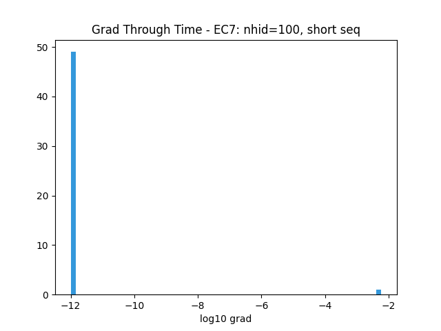
  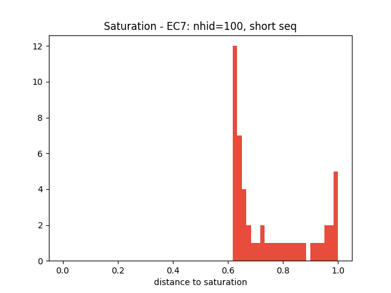

  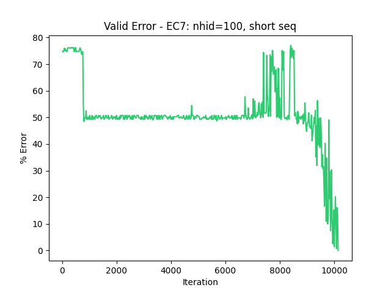
  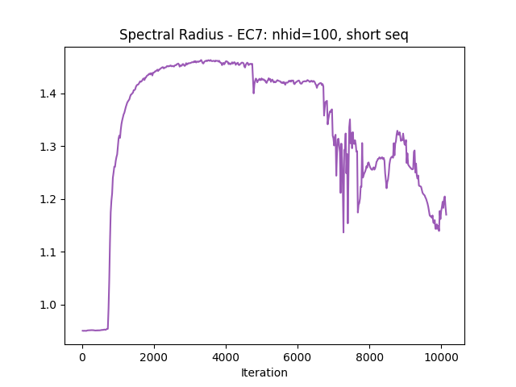

#### EC9: Partial Success (Long Sequences)
EC9 used full-length sequences (50–200) and `nhid=500, bs=200`. It reached NLL=0.75 and 3.89% validation error.

  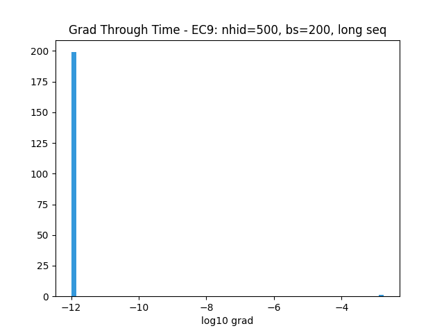
  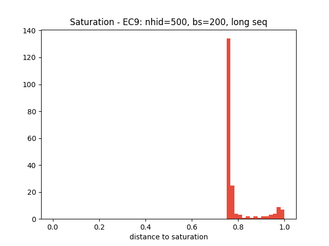

  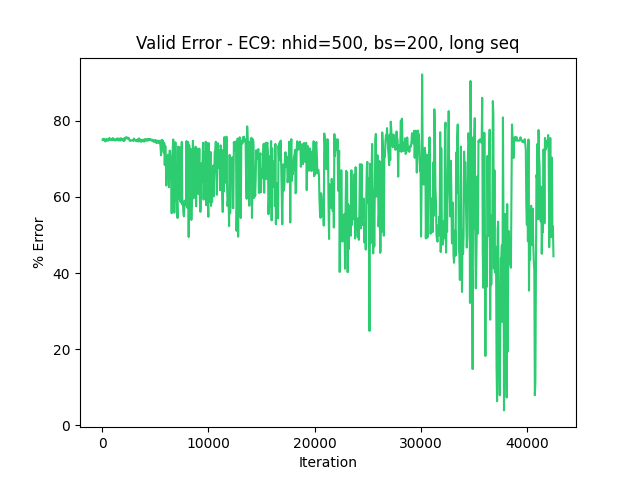
  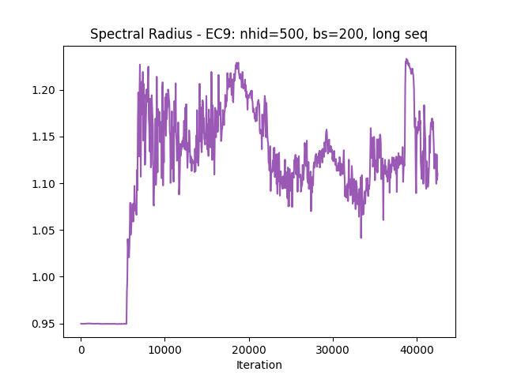

The Pascanu SGD-CR method (smart_tanh init + $\Omega$ reg + clipping) successfully breaks through the NLL=1.386 floor. Short sequences are fully solvable (0% error, EC7). Full-length sequences require scaling up model capacity and batch size (EC9, 3.89% error).

---

## 8. Appendix: All Figures

### A1: Baseline RNN (No Clip)

  
  

  
  

### A2: RNN Clip=0.05

  
  

  
  

### A3: RNN Clip=0.01

  
  

  
  

### A4: GRU (No Clip)

  
  

  
  

  
  

### A5: GRU Clip=0.05

  
  

  
  

  
  

### B1: RNN Multiplication (No Clip)

  
  

  
  

### B2: GRU Multiplication (No Clip)

  
  

  
  

  
  

### Comparison Plots

#### Task 1: Memorization Comparison

  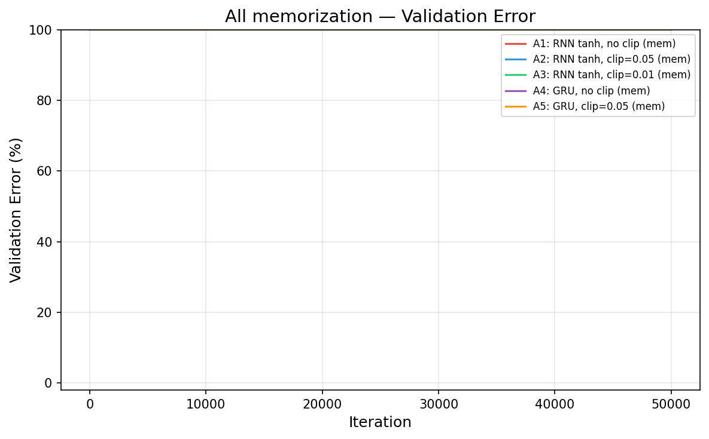
  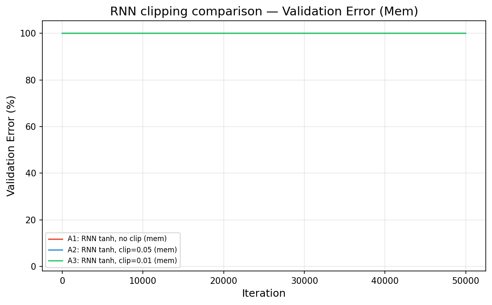

  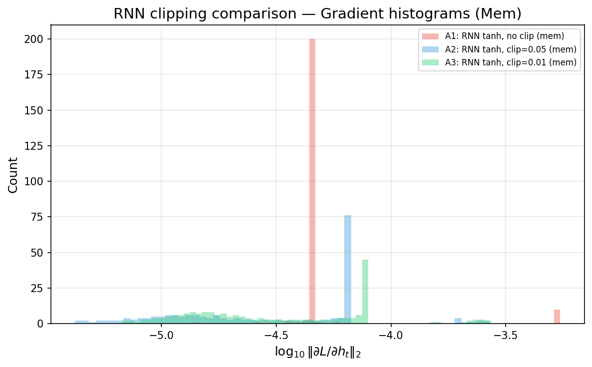
  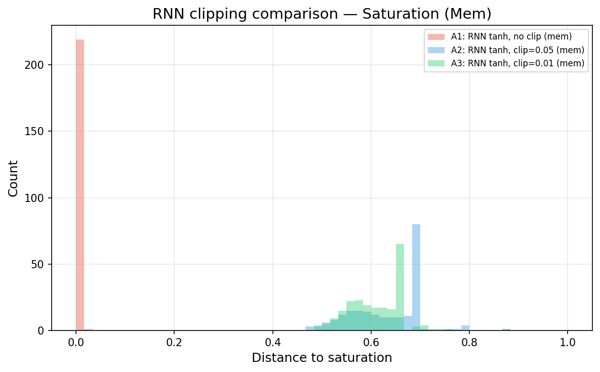

  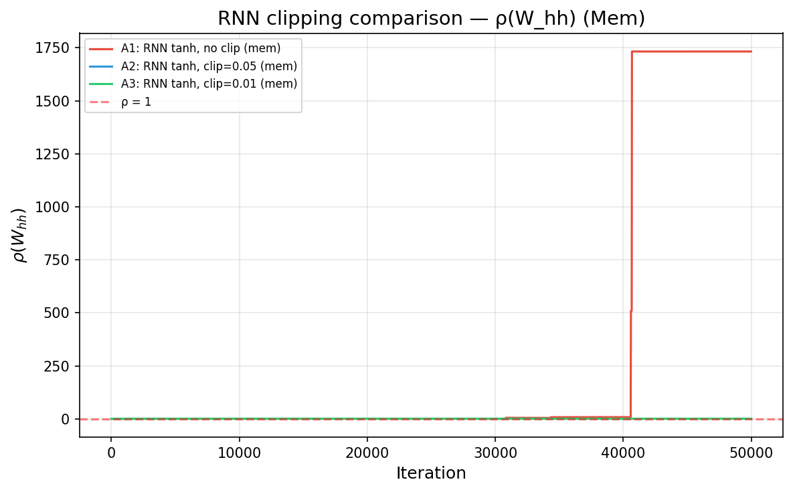

  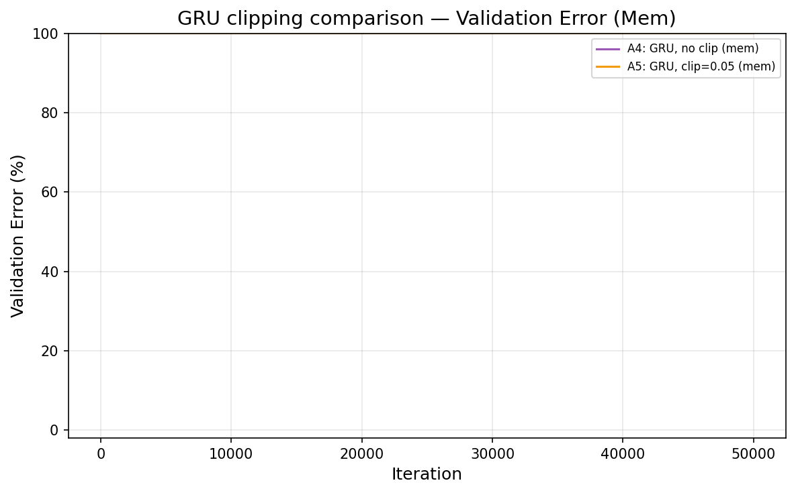
  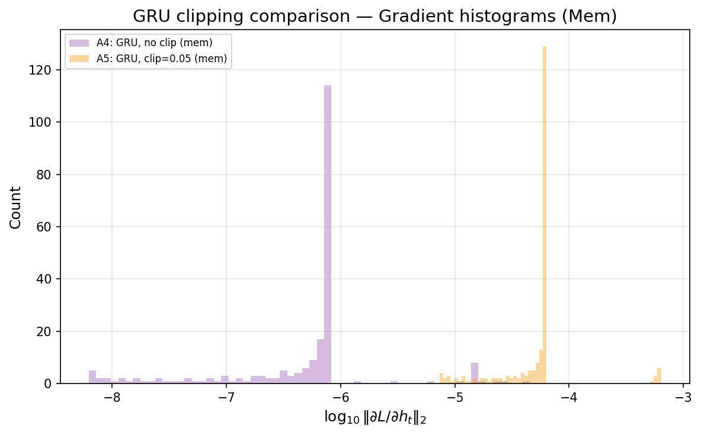

  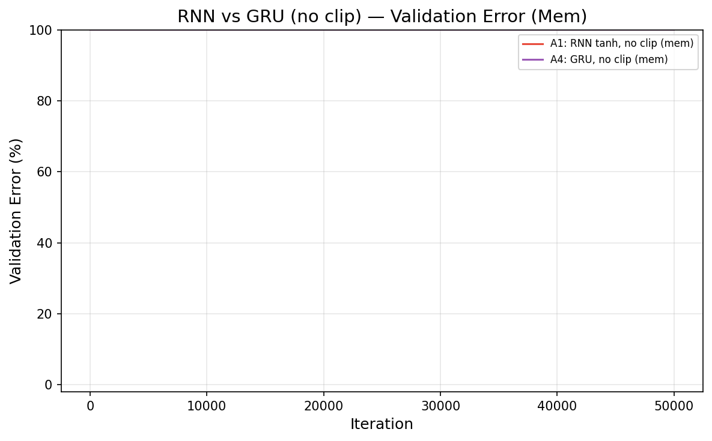
  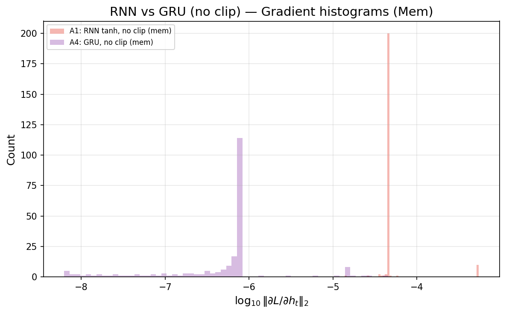

  

  

#### Task 2: Multiplication Comparison

  
  

  

---

## 9. AI Tool Disclosure

As per the mandatory disclosure policy (Section 10.6):

This assignment was completed with AI assistance (**Google Gemini** and **ChatGPT**) used for:
- Conceptual clarification of gradient flow diagnostics
- Structuring the experimental pipeline (run scripts, plotting utilities)

### AI Disclosure Links:
- ChatGPT Chat 1: https://chatgpt.com/share/69b30199-a418-8006-b1e3-56ae88eb541a
- ChatGPT Chat 2: https://chatgpt.com/share/69b30178-bf30-8006-87e8-0dacca5fe56a

Per the assignment policy: *"AI tools are for conceptual help only; code generation is prohibited."* The core RNN/GRU implementation (`model.py`) and training diagnostics (`train.py`) were reviewed and understood in full by the student.

---

*End of Report*
